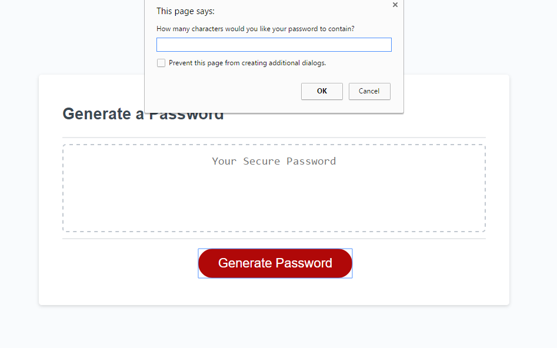
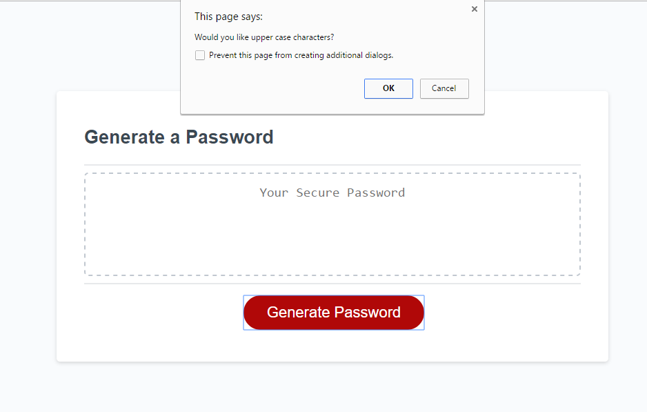
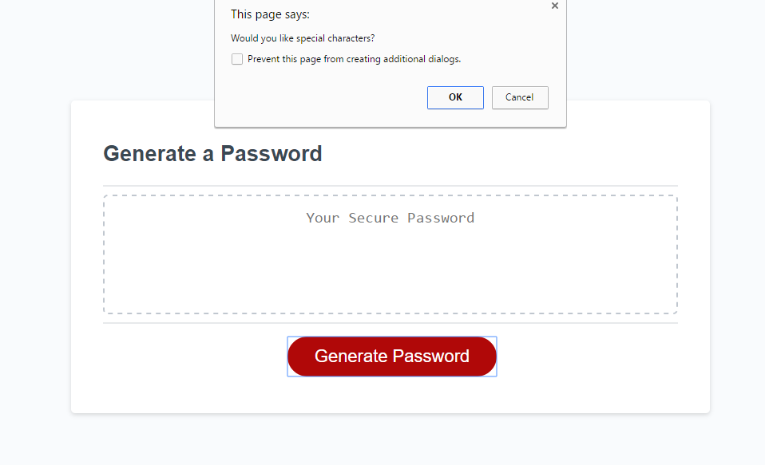
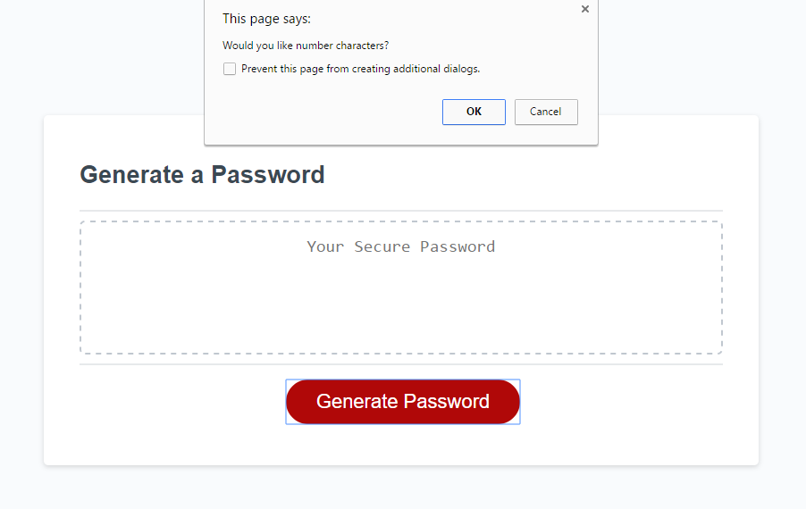
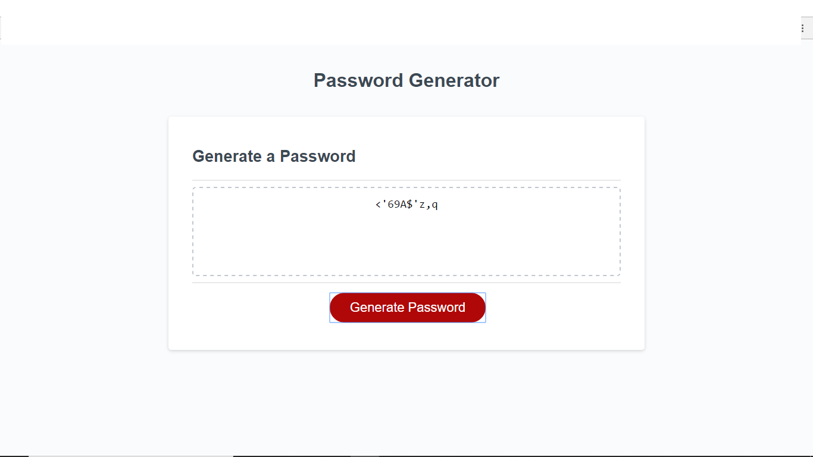

# Password-Generator
In this project, I will be generating an application that an employee can use to generate random passwords.

## Overview
The goal for this project was to create a password generator that suited the criteria of the client.

-A series of prompts collects user data.
-Length of at least 8 characters and no more than 128 characters. 
-All prompts are answered.

### Password Generator Preview 

### Password Generator Link:
 https://xicano619.github.io/Password-Generator/
